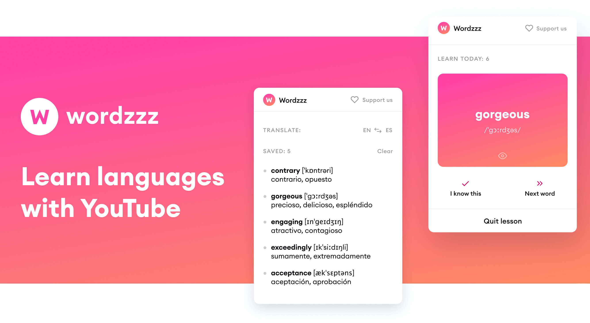

  <a href="https://wordzzz.app"></img></a>

<h1 align="center">Hello, Word!</h1>

  <b>Download:</b>
  <a href="https://chrome.google.com/webstore/detail/wordzzz-%E2%80%93-learn-language/iekapmfhbnlnpgapdilmdlehfmelengm">Chrome/Chromium</a> |
  <a href="https://addons.mozilla.org/en-US/firefox/addon/wordzzz-learn-languages-by-sub">Firefox</a> |
  <a href="https://apps.apple.com/us/app/wordzzz/id1536124213">Safari</a> |
  <a href="https://wordzzz.app">Website</a> |
  <a href="https://www.patreon.com/wordzzz">Buy us a coffee</a>

  <a href="https://chrome.google.com/webstore/detail/wordzzz-%E2%80%93-learn-language/iekapmfhbnlnpgapdilmdlehfmelengm"></img></a>
  <a href="https://addons.mozilla.org/addon/sponsorblock/?src=external-github"></img></a>

# Modules

## Extension

`cd ./packages/extension`

[README](./packages/extension/README.md)

## Web

`cd ./packages/web`

## Common

`cd ./packages/common`

### Scripts

Run `npm run build` to generate a Chrome extension and web dist.

Use `npm run dev` for development.

The result is in `dist`.
